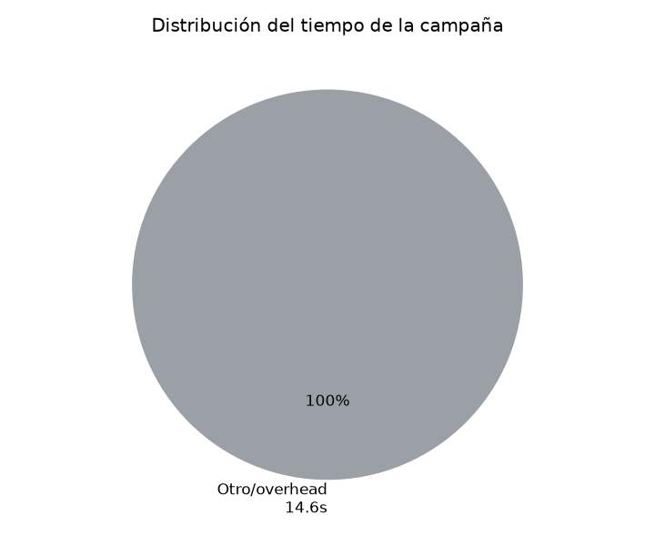

# Reporte de métricas — 2026-06-23 02:20:16

- **Objetivo (target):** `http://testphp.vulnweb.com`
- **Misión:** SOLO HAZ ENUMERCIOND E PEURTOS PARA ENCONTRAR PUERTOS ABIERTOS
- **Duración total:** 14s
- **Resultado:** ❌ No  ·  **Motivo de término:** `limite_iteraciones`

## Resumen ejecutivo

| Métrica | Valor |
|---|---|
| Iteraciones | 0 |
| Llamadas al LLM | 0 |
| Tokens totales | 0 (entrada 0 / salida 0) |
| Costo estimado LLM | ~$0.0000 USD |
| Tareas ejecutadas (runner) | 0 |
| Tasa de éxito de ejecución | 0% (0/0) |
| Tiempo en LLM / runner | 0s / 0s |

> El costo es **estimado** con tarifas orientativas de DeepSeek ($0.27/1M entrada, $1.1/1M salida); ajústalas en `metricas/collector.py`.

## Tiempo

## Consumo de LLM (tokens y costo)

_Sin datos para «Tokens por agente»._

## Coordinación del Commander

Decisiones de orquestación (qué fase asignó en cada paso):

| # | Decisión | Razón |
|---|---|---|
| 1 | asignar `exploracion` | fallback por error: Error code: 401 - {'error': {'message': 'Authentication Fails, Your api key: ****-... is invalid', 'type': 'authentication_error', 'param': None, 'code': 'invalid_request_error'}} |

> El Commander **no** asignó la fase de explotación.

## Eficiencia del Summarizer (memoria estructurada)

_Sin datos para «Ahorro de contexto del Summarizer»._

## Iteraciones y decisiones (IA ↔ Juez)

_Sin datos para «Tareas por iteración»._

| Fase | Iteración | Tareas | Decisión IA | Decisión Juez |
|---|---|---|---|---|
| exploracion | 1 | 0 | — | — |
| exploracion | 2 | 0 | — | — |
| exploracion | 3 | 0 | — | — |
| exploracion | 4 | 0 | — | — |
| exploracion | 5 | 0 | — | — |
| exploracion | 6 | 0 | — | — |

**Acuerdo IA ↔ Juez** (cuándo coinciden y cuándo no):

| Situación | Veces |
|---|---|
| Ambos coinciden en terminar | 0 |
| Ambos coinciden en seguir | 0 |
| IA quería terminar pero el Juez insistió | 0 |
| IA quería seguir pero el Juez aprobó (cortó) | 0 |

## Ejecución de herramientas

_Sin datos para «Éxito vs fallo por herramienta»._

## Cobertura final (KB del Explorador)

| Categoría | Cantidad |
|---|---|
| servicios | 0 |
| rutas | 0 |
| archivos | 0 |
| flags | 0 |
| hallazgos | 0 |
| pendientes | 0 |
| descartado | 0 |

## Errores registrados

- **llm**: Error code: 401 - {'error': {'message': 'Authentication Fails, Your api key: ****-... is invalid', 'type': 'authentication_error', 'param': None, 'code': 'invalid_request_error'}}
- **llm**: Error code: 401 - {'error': {'message': 'Authentication Fails, Your api key: ****-... is invalid', 'type': 'authentication_error', 'param': None, 'code': 'invalid_request_error'}}
- **llm**: Error code: 401 - {'error': {'message': 'Authentication Fails, Your api key: ****-... is invalid', 'type': 'authentication_error', 'param': None, 'code': 'invalid_request_error'}}
- **llm**: Error code: 401 - {'error': {'message': 'Authentication Fails, Your api key: ****-... is invalid', 'type': 'authentication_error', 'param': None, 'code': 'invalid_request_error'}}
- **llm**: Error code: 401 - {'error': {'message': 'Authentication Fails, Your api key: ****-... is invalid', 'type': 'authentication_error', 'param': None, 'code': 'invalid_request_error'}}
- **llm**: Error code: 401 - {'error': {'message': 'Authentication Fails, Your api key: ****-... is invalid', 'type': 'authentication_error', 'param': None, 'code': 'invalid_request_error'}}
- **llm**: Error code: 401 - {'error': {'message': 'Authentication Fails, Your api key: ****-... is invalid', 'type': 'authentication_error', 'param': None, 'code': 'invalid_request_error'}}
- **llm**: Error code: 401 - {'error': {'message': 'Authentication Fails, Your api key: ****-... is invalid', 'type': 'authentication_error', 'param': None, 'code': 'invalid_request_error'}}
- **llm**: Error code: 401 - {'error': {'message': 'Authentication Fails, Your api key: ****-... is invalid', 'type': 'authentication_error', 'param': None, 'code': 'invalid_request_error'}}
- **llm**: Error code: 401 - {'error': {'message': 'Authentication Fails, Your api key: ****-... is invalid', 'type': 'authentication_error', 'param': None, 'code': 'invalid_request_error'}}
- **llm**: Error code: 401 - {'error': {'message': 'Authentication Fails, Your api key: ****-... is invalid', 'type': 'authentication_error', 'param': None, 'code': 'invalid_request_error'}}
- **llm**: Error code: 401 - {'error': {'message': 'Authentication Fails, Your api key: ****-... is invalid', 'type': 'authentication_error', 'param': None, 'code': 'invalid_request_error'}}
- **llm**: Error code: 401 - {'error': {'message': 'Authentication Fails, Your api key: ****-... is invalid', 'type': 'authentication_error', 'param': None, 'code': 'invalid_request_error'}}
- **llm**: Error code: 401 - {'error': {'message': 'Authentication Fails, Your api key: ****-... is invalid', 'type': 'authentication_error', 'param': None, 'code': 'invalid_request_error'}}
- **llm**: Error code: 401 - {'error': {'message': 'Authentication Fails, Your api key: ****-... is invalid', 'type': 'authentication_error', 'param': None, 'code': 'invalid_request_error'}}
- **llm**: Error code: 401 - {'error': {'message': 'Authentication Fails, Your api key: ****-... is invalid', 'type': 'authentication_error', 'param': None, 'code': 'invalid_request_error'}}
- **llm**: Error code: 401 - {'error': {'message': 'Authentication Fails, Your api key: ****-... is invalid', 'type': 'authentication_error', 'param': None, 'code': 'invalid_request_error'}}
- **llm**: Error code: 401 - {'error': {'message': 'Authentication Fails, Your api key: ****-... is invalid', 'type': 'authentication_error', 'param': None, 'code': 'invalid_request_error'}}
- **llm**: Error code: 401 - {'error': {'message': 'Authentication Fails, Your api key: ****-... is invalid', 'type': 'authentication_error', 'param': None, 'code': 'invalid_request_error'}}
- **llm**: Error code: 401 - {'error': {'message': 'Authentication Fails, Your api key: ****-... is invalid', 'type': 'authentication_error', 'param': None, 'code': 'invalid_request_error'}}
- **llm**: Error code: 401 - {'error': {'message': 'Authentication Fails, Your api key: ****-... is invalid', 'type': 'authentication_error', 'param': None, 'code': 'invalid_request_error'}}
- **llm**: Error code: 401 - {'error': {'message': 'Authentication Fails, Your api key: ****-... is invalid', 'type': 'authentication_error', 'param': None, 'code': 'invalid_request_error'}}
- **llm**: Error code: 401 - {'error': {'message': 'Authentication Fails, Your api key: ****-... is invalid', 'type': 'authentication_error', 'param': None, 'code': 'invalid_request_error'}}
- **llm**: Error code: 401 - {'error': {'message': 'Authentication Fails, Your api key: ****-... is invalid', 'type': 'authentication_error', 'param': None, 'code': 'invalid_request_error'}}
- **llm**: Error code: 401 - {'error': {'message': 'Authentication Fails, Your api key: ****-... is invalid', 'type': 'authentication_error', 'param': None, 'code': 'invalid_request_error'}}
- **llm**: Error code: 401 - {'error': {'message': 'Authentication Fails, Your api key: ****-... is invalid', 'type': 'authentication_error', 'param': None, 'code': 'invalid_request_error'}}
- **llm**: Error code: 401 - {'error': {'message': 'Authentication Fails, Your api key: ****-... is invalid', 'type': 'authentication_error', 'param': None, 'code': 'invalid_request_error'}}
