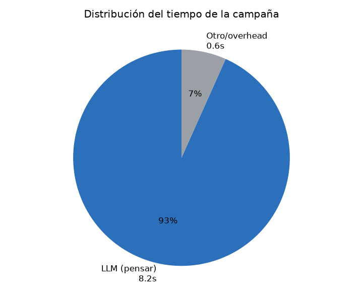
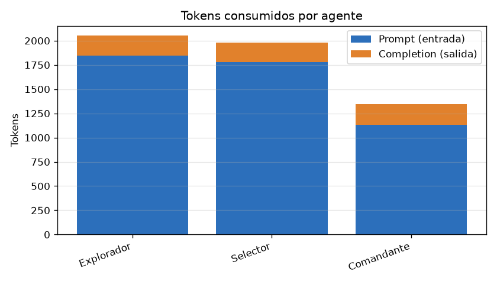

# Reporte de métricas — 2026-06-24 21:57:25

- **Objetivo (target):** `http://testphp.vulnweb.com`
- **Misión:** SOLO HAZ ENUMERCIOND E PEURTOS PARA ENCONTRAR PUERTOS ABIERTOS
- **Duración total:** 8s
- **Resultado:** ❌ No  ·  **Motivo de término:** `KeyError`

## Resumen ejecutivo

| Métrica | Valor |
|---|---|
| Iteraciones | 0 |
| Llamadas al LLM | 3 |
| Tokens totales | 5,377 (entrada 4,757 / salida 620) |
| Costo estimado LLM | ~$0.0020 USD |
| Tareas ejecutadas (runner) | 0 |
| Tasa de éxito de ejecución | 0% (0/0) |
| Tiempo en LLM / runner | 8s / 0s |

> El costo es **estimado** con tarifas orientativas de DeepSeek ($0.27/1M entrada, $1.1/1M salida); ajústalas en `metricas/collector.py`.

## Tiempo

## Consumo de LLM (tokens y costo)

| Agente | Llamadas | Prompt | Completion | Total |
|---|---|---|---|---|
| Explorador | 1 | 1,847 | 204 | 2,051 |
| Selector | 1 | 1,781 | 198 | 1,979 |
| Comandante | 1 | 1,129 | 218 | 1,347 |

## Coordinación del Commander

Decisiones de orquestación (qué fase asignó en cada paso):

| # | Decisión | Razón |
|---|---|---|
| 1 | asignar `exploracion` | Es la primera fase de la campaña. El objetivo es enumerar puertos abiertos en http://testphp.vulnweb.com. La exploración black-box es necesaria para descubrir qué servicios, rutas y archivos están expuestos antes de considerar cualquier otra acción. |

> El Commander **no** asignó la fase de explotación.

## Eficiencia del Summarizer (memoria estructurada)

_Sin datos para «Ahorro de contexto del Summarizer»._

## Iteraciones y decisiones (IA ↔ Juez)

_Sin datos para «Tareas por iteración»._

| Fase | Iteración | Tareas | Decisión IA | Decisión Juez |
|---|---|---|---|---|
| exploracion | 1 | 0 | — | — |

**Acuerdo IA ↔ Juez** (cuándo coinciden y cuándo no):

| Situación | Veces |
|---|---|
| Ambos coinciden en terminar | 0 |
| Ambos coinciden en seguir | 0 |
| IA quería terminar pero el Juez insistió | 0 |
| IA quería seguir pero el Juez aprobó (cortó) | 0 |

## Ejecución de herramientas

_Sin datos para «Éxito vs fallo por herramienta»._

## Cobertura final (KB del Explorador)

| Categoría | Cantidad |
|---|---|
| servicios | 0 |
| rutas | 0 |
| archivos | 0 |
| flags | 0 |
| hallazgos | 0 |
| pendientes | 0 |
| descartado | 0 |
