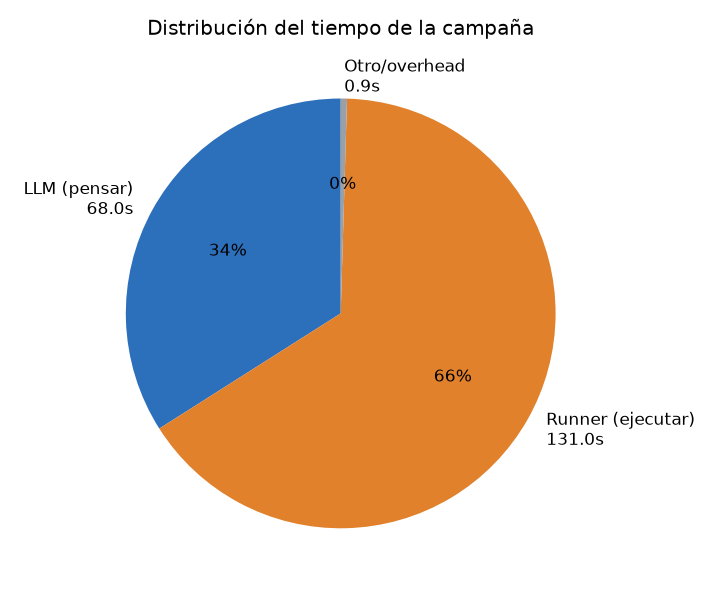
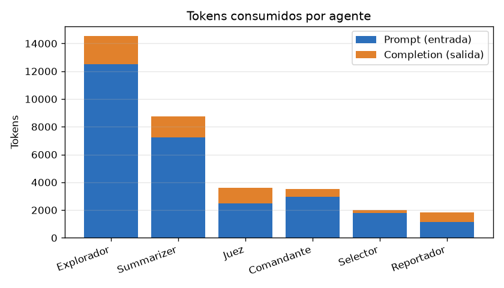
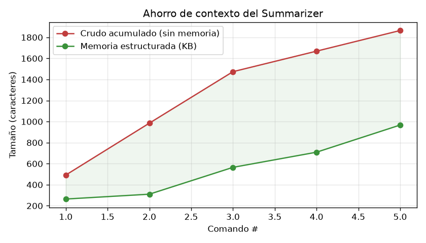
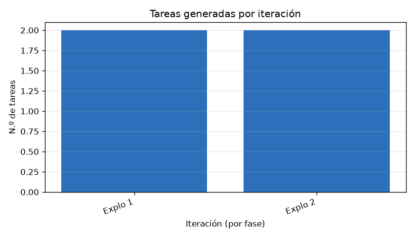
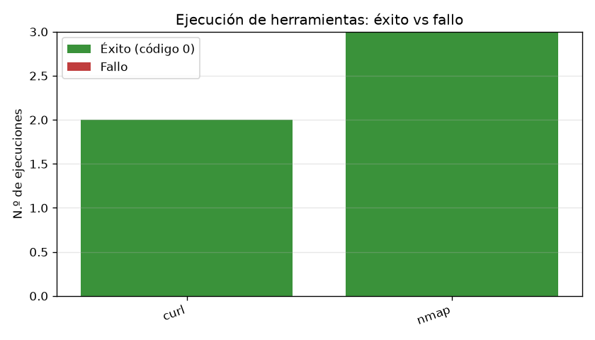

# Reporte de métricas — 2026-06-24 22:54:34

- **Objetivo (target):** `http://testphp.vulnweb.com`
- **Misión:** SOLO HAZ ENUMERCIOND E PEURTOS PARA ENCONTRAR PUERTOS ABIERTOS
- **Duración total:** 3m 19s
- **Resultado:** ✅ Sí  ·  **Motivo de término:** `juez_aprobo_exito`

## Resumen ejecutivo

| Métrica | Valor |
|---|---|
| Iteraciones | 2 |
| Llamadas al LLM | 18 |
| Tokens totales | 34,247 (entrada 28,128 / salida 6,119) |
| Costo estimado LLM | ~$0.0143 USD |
| Tareas ejecutadas (runner) | 5 |
| Tasa de éxito de ejecución | 100% (5/5) |
| Tiempo en LLM / runner | 1m 7s / 2m 11s |

> El costo es **estimado** con tarifas orientativas de DeepSeek ($0.27/1M entrada, $1.1/1M salida); ajústalas en `metricas/collector.py`.

## Tiempo

## Consumo de LLM (tokens y costo)

| Agente | Llamadas | Prompt | Completion | Total |
|---|---|---|---|---|
| Explorador | 7 | 12,513 | 2,008 | 14,521 |
| Summarizer | 5 | 7,215 | 1,518 | 8,733 |
| Juez | 2 | 2,491 | 1,134 | 3,625 |
| Comandante | 2 | 2,976 | 545 | 3,521 |
| Selector | 1 | 1,781 | 221 | 2,002 |
| Reportador | 1 | 1,152 | 693 | 1,845 |

## Coordinación del Commander

Decisiones de orquestación (qué fase asignó en cada paso):

| # | Decisión | Razón |
|---|---|---|
| 1 | asignar `exploracion` | Es la primera fase de la campaña. Debemos realizar un escaneo de puertos y servicios en http://testphp.vulnweb.com para identificar puertos abiertos, de acuerdo con el objetivo de la misión (solo enumeración de puertos). |
| 2 | **finalizar campaña** | La exploración de puertos se completó exhaustivamente (rangos 1-1000, 1-10000 y puertos web 80,443,8080,8443) y todos los puertos aparecen como filtrados. No se ha detectado ningún puerto abierto en el objetivo http://testphp.vulnweb.com. Dado que la misión es únicamente enumerar puertos para encontrar abiertos, y no existen puertos abiertos detectables, no hay superficie explotable ni fases adicionales que aporten valor. Campaña finalizada. |

> El Commander **no** asignó la fase de explotación.

## Eficiencia del Summarizer (memoria estructurada)

Tras 5 comando(s): crudo acumulado **1,865** chars vs memoria **967** chars → compresión **1.9×** (~48% menos contexto que arrastrar todo el transcript).

## Iteraciones y decisiones (IA ↔ Juez)

| Fase | Iteración | Tareas | Decisión IA | Decisión Juez |
|---|---|---|---|---|
| exploracion | 1 | 2 | terminar | rechaza |
| exploracion | 2 | 2 | terminar | aprueba |

**Acuerdo IA ↔ Juez** (cuándo coinciden y cuándo no):

| Situación | Veces |
|---|---|
| Ambos coinciden en terminar | 1 |
| Ambos coinciden en seguir | 0 |
| IA quería terminar pero el Juez insistió | 1 |
| IA quería seguir pero el Juez aprobó (cortó) | 0 |

## Ejecución de herramientas

| Herramienta | Ejecuciones | Éxito | Fallo | Latencia media |
|---|---|---|---|---|
| curl | 2 | 2 | 0 | 24.7s |
| nmap | 3 | 3 | 0 | 27.2s |

## Cobertura final (KB del Explorador)

| Categoría | Cantidad |
|---|---|
| servicios | 0 |
| rutas | 0 |
| archivos | 0 |
| flags | 0 |
| hallazgos | 2 |
| pendientes | 0 |
| descartado | 5 |
