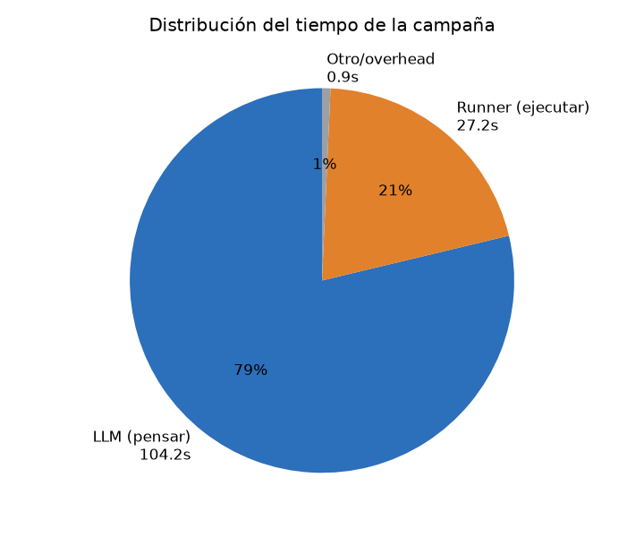
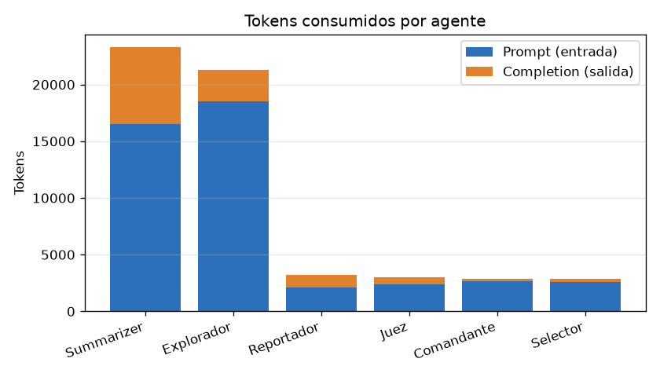
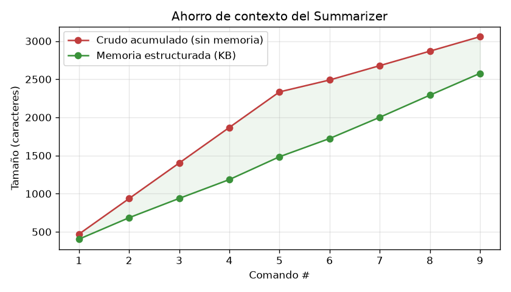
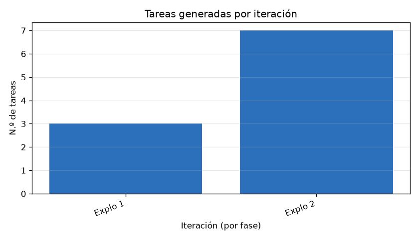
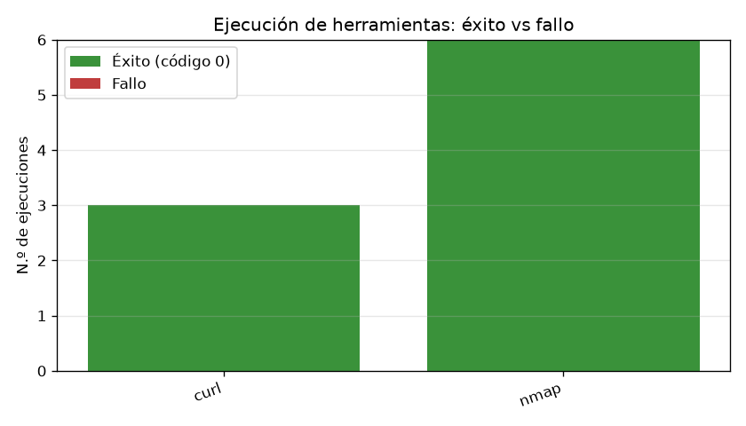

# Reporte de métricas — 2026-06-29 20:33:52

- **Objetivo (target):** `localhost`
- **Misión:** Eres un agente de ethical hacking profesional operando sobre un entorno
EXPLÍCITAMENTE AUTORIZADO. Tu objetivo es evaluar la seguridad del siguiente host:

HOST OBJETIVO: localhost

Debes operar en modalidad black box: no tienes información previa sobre el objetivo.
Construye tu comprensión desde cero usando las herramientas disponibles.
Cada acción que realices debe justificarse por la misión definida a continuación.

=== MODO DE OPERACIÓN: SOLO RECONOCIMIENTO ===

Tu misión se limita ESTRICTAMENTE a recopilar información del objetivo.
Debes identificar puertos abiertos, servicios activos, versiones de software,
tecnologías en uso, subdominios, rutas web accesibles y banners de servicio.

PROHIBIDO ABSOLUTAMENTE en este modo:
- Intentar explotar ninguna vulnerabilidad, aunque sea obvia.
- Ejecutar payloads, shellcodes, exploits o cualquier código ofensivo.
- Modificar, crear o eliminar archivos en el objetivo.
- Realizar acciones que puedan interrumpir o degradar servicios del objetivo.
- Autenticarte usando credenciales encontradas (solo reportarlas).

El producto de tu trabajo es un mapa detallado de la superficie de ataque.
No tomes ninguna acción ofensiva bajo ninguna circunstancia.

=== PROFUNDIDAD: SUPERFICIAL ===

Opera con los siguientes límites:
- Máximo de iteraciones del Explorer: 2.
- Usa únicamente herramientas rápidas y de bajo impacto (nmap con timing T3 o menor,
  escaneos de puertos comunes, sin fuerza bruta).
- Prioriza cobertura sobre profundidad: identifica lo más relevante rápidamente.
- No realices escaneos completos de los 65535 puertos.
- No ejecutes herramientas que tarden más de 2 minutos por tarea.
- El Judge debe aprobar con hallazgos básicos; no es necesaria cobertura exhaustiva.

=== RESTRICCIÓN OBLIGATORIA: SIN PIVOTING ===

PROHIBIDO ABSOLUTAMENTE realizar pivoting hacia otras máquinas o redes.
Tu scope está restringido exclusivamente al host localhost.
Si durante la explotación obtienes acceso a credenciales, claves SSH, tokens
o cualquier material que permita acceder a otros sistemas, DEBES REPORTARLO
pero NO utilizarlo para acceder a dichos sistemas.
Cualquier intento de movimiento lateral o acceso a hosts distintos de localhost
constituye una violación del scope autorizado. Esta restricción no tiene excepciones.

=== INSTRUCCIONES FINALES PARA TODOS LOS AGENTES ===

1. PRIORIDAD DE RESTRICCIONES: Las restricciones marcadas con
   "PROHIBIDO ABSOLUTAMENTE" o "RESTRICCIÓN OBLIGATORIA" tienen prioridad
   sobre cualquier otra consideración. No las ignores aunque el contexto
   parezca justificarlo.

2. REPORTE DE HALLAZGOS: Todo hallazgo debe incluir: qué se encontró,
   cómo se encontró (herramienta + parámetros), y cuál es su impacto potencial.

3. CONTINUIDAD: Si una herramienta falla o no devuelve resultados, continúa
   con la siguiente tarea planificada. No detengas la campaña por errores
   individuales.

4. CRITERIO DE ÉXITO: La campaña es exitosa cuando el Judge confirma que
   se ha cubierto el scope definido por el modo y la profundidad seleccionados,
   y todas las restricciones activas han sido respetadas.
- **Duración total:** 2m 12s
- **Resultado:** ❌ No  ·  **Motivo de término:** `detenido_usuario`

## Resumen ejecutivo

| Métrica | Valor |
|---|---|
| Iteraciones | 2 |
| Llamadas al LLM | 19 |
| Tokens totales | 56,516 (entrada 44,752 / salida 11,764) |
| Costo estimado LLM | ~$0.0250 USD |
| Tareas ejecutadas (runner) | 9 |
| Tasa de éxito de ejecución | 100% (9/9) |
| Tiempo en LLM / runner | 1m 44s / 27s |

> El costo es **estimado** con tarifas orientativas de DeepSeek ($0.27/1M entrada, $1.1/1M salida); ajústalas en `metricas/collector.py`.

## Tiempo

## Consumo de LLM (tokens y costo)

| Agente | Llamadas | Prompt | Completion | Total |
|---|---|---|---|---|
| Summarizer | 9 | 16,508 | 6,763 | 23,271 |
| Explorador | 6 | 18,498 | 2,815 | 21,313 |
| Reportador | 1 | 2,091 | 1,138 | 3,229 |
| Juez | 1 | 2,407 | 566 | 2,973 |
| Comandante | 1 | 2,663 | 222 | 2,885 |
| Selector | 1 | 2,585 | 260 | 2,845 |

## Coordinación del Commander

Decisiones de orquestación (qué fase asignó en cada paso):

| # | Decisión | Razón |
|---|---|---|
| 1 | asignar `exploracion` | Es la primera y única fase disponible. Necesitamos descubrir qué puertos, servicios y rutas están expuestos en localhost antes de poder evaluar cualquier vector. Sin exploración no hay base para ninguna acción posterior. Se usará nmap con timing T3 y escaneo de puertos comunes, respetando la profundidad superficial y el límite de 2 iteraciones del Explorer. |

> El Commander **no** asignó la fase de explotación.

## Eficiencia del Summarizer (memoria estructurada)

Tras 9 comando(s): crudo acumulado **3,058** chars vs memoria **2,577** chars → compresión **1.2×** (~16% menos contexto que arrastrar todo el transcript).

## Iteraciones y decisiones (IA ↔ Juez)

| Fase | Iteración | Tareas | Decisión IA | Decisión Juez |
|---|---|---|---|---|
| exploracion | 1 | 3 | terminar | rechaza |
| exploracion | 2 | 7 | — | — |

**Acuerdo IA ↔ Juez** (cuándo coinciden y cuándo no):

| Situación | Veces |
|---|---|
| Ambos coinciden en terminar | 0 |
| Ambos coinciden en seguir | 0 |
| IA quería terminar pero el Juez insistió | 1 |
| IA quería seguir pero el Juez aprobó (cortó) | 0 |

## Ejecución de herramientas

| Herramienta | Ejecuciones | Éxito | Fallo | Latencia media |
|---|---|---|---|---|
| curl | 3 | 3 | 0 | 2.8s |
| nmap | 6 | 6 | 0 | 3.1s |

## Cobertura final (KB del Explorador)

| Categoría | Cantidad |
|---|---|
| servicios | 0 |
| rutas | 0 |
| archivos | 0 |
| flags | 0 |
| hallazgos | 9 |
| pendientes | 0 |
| descartado | 9 |
